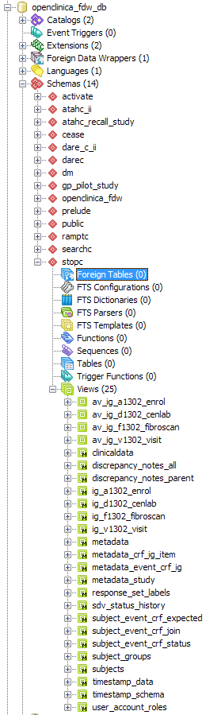

# Output

## Summary
- [Core Objects](#core-objects)
- [Study Schemas](#study-schemas)
  + [Item Group Matviews](#item-group-matviews)
  + [Item Columns](#item-columns)
  + [Item Group Views](#item-group-views)
- [Example Output for a Study Schema](#example-output-for-a-study-schema)
- [An Ugly System Diagram](#an-ugly-system-diagram)

## Core Objects
After completing setup, the following objects should be present:

- openclinica_fdw schema: 
  - foreign tables
    - 111 OpenClinica
    - 4 pg_catalog
  - matviews
    - 111 OpenClinica
  - functions
    - 35 datamart
    - 2 postgres foreign data wrapper
- public schema
  - functions
    - 2 datamart
- dm schema
  - matviews
    - 16 datamart
  - views
    - 4 datamart

## Study Schemas
In addition to the core objects, for each study in dm.metadata_study that does 
not have a status of "removed", a schema will be created. The name of the 
schema will be the one shown in dm.metadata_study.study_name_clean. In each 
study schema, there should be:

- matviews (17+)
  - 15 datamart (copy of dm schema matviews, excluding dm.response_sets, 
    filtered for rows where the study name is the same as the schema study name)
  - 2 timestamp (data last refreshed, schema last created)
  - 1 for each item group that is part of a CRF which has been associated with 
    an event in that study. See below for more on these objects.
- views
  - 1 for each item group matview

### Item Group Matviews
For the item group matviews, there are always the following columns in order to
identify the row:

- study name
- site oid
- site name
- subject id
- event oid
- event name
- event order
- event repeat
- crf parent name
- crf version
- crf status

These columns are followed by additional columns for the items in the item group.

### Item Columns
For each item in the item group, there is one column. The name of the column is 
either:

- item oid, if any item name in the study is longer than 12 characters
- otherwise, first 12 characters of item name + first 45 of item description

If the item has a choice list, there will be two columns:

- the coded value, with the column name as described above
- the value label, with the column name + "_label"

If the item is a multi-select or checkbox, there will be a pair of the above 
two columns for each choice. For example a checkbox named "myitem" with the 
choices "1,0,9" for "Yes,No,Maybe" would be represented with the following 
columns:

- myitem_1
- myitem_1_label
- myitem_0
- myitem_0_label
- myitem_9
- myitem_9_label

The correspondence of OpenClinica item data types to postgres column types are 
as follows. The choice "_label" columns are always TEXT.

- ST (String) = TEXT
- INT (Integer) = NUMERIC
- REAL (Float) = NUMERIC
- DATE (Date) = DATE
- PDATE (Partial Date) = TEXT
- FILE (File) = TEXT

### Item Group Views
SAS and Stata (and probably other statistical software) have variable name 
limits somewhere in the region of 32 characters. 

In order to provide compatibility for these programs when retreiving data, for 
each item group matview, a matching view is created. The view is named with the 
item group oid, prefixed with "av_", for Alias View. 

In each alias view, the item columns are aliased with the item name, which 
should be the shortest possible unique identifier. It may be that the item name 
is still longer than 32 characters, but generally that should not be the case.

For example, an item column named "myitem" with a description "this is my first 
item with a really long description" would appear as 
"myitem_this_is_my_first_item_with_a_really_long_desc" in the matview. In the 
alias view, this column would be renamed to "myitem".

## Example Output for a Study Schema

## An Ugly System Diagram
